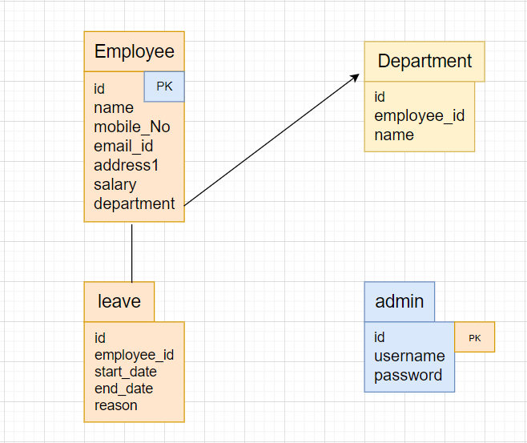

Welcome to the Employee Management System project! This application is built using Spring Boot, Java, and MySQL, and it facilitates the management of employee records.

Features
Create Employee: Add new employees to the system.
Read Employee: View existing employee details.
Update Employee: Modify employee information.
Delete Employee: Remove employees from the system.
Technologies Used
Spring Boot: Framework for building Java-based applications.
Java: Programming language used for application logic.
MySQL: Relational database for storing employee data.
Postman: API client for testing and interacting with APIs.

Configure MySQL:
Create a MySQL database named employeemanagement.
Update the application.properties file in src/main/resources with your MySQL username and password.

Access the Application:

Once the application is running, you can access it at in your web browser.
http://localhost:8080 

Test API Endpoints:

Use the imported collection to test the API endpoints:
Create, Read, Update, and Delete employees.
Verify responses and check for any errors.

for add employee :- http://localhost:8080/employee/add

for get all employee list :- http://localhost:8080/employee/getAll

for get employee by id :- http://localhost:8080/employee/{}

for updated employee :- http://localhost:8080/employee/{}

for delete employee :- http://localhost:8080/employee/{}

